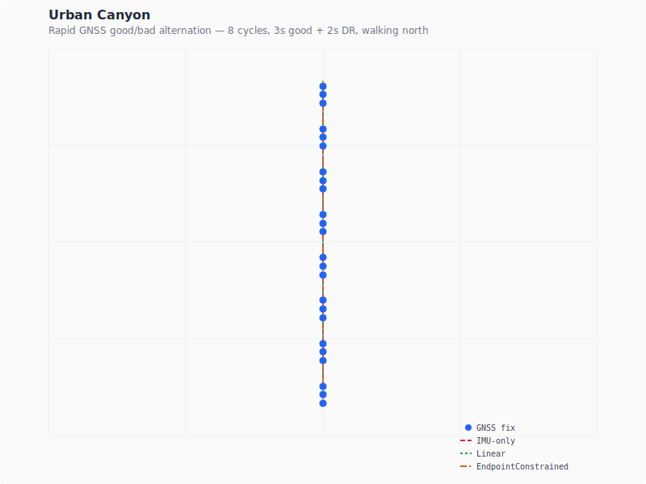
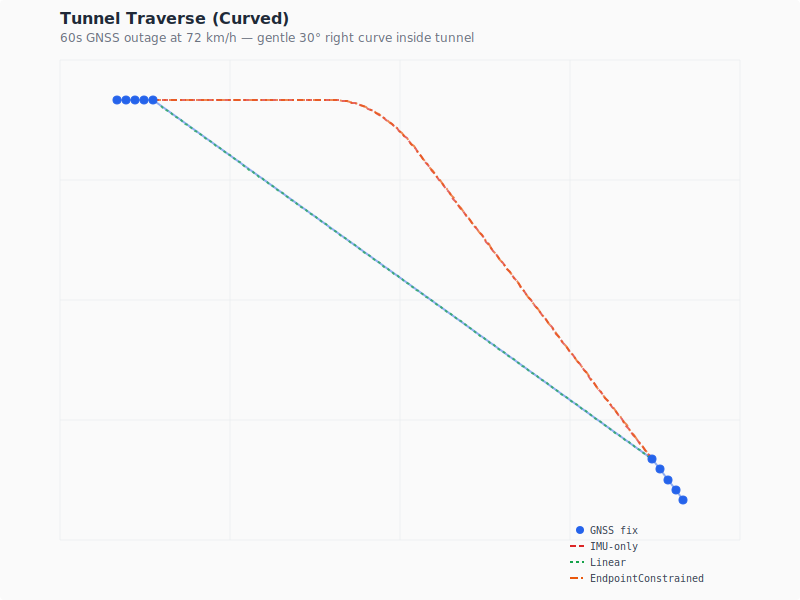
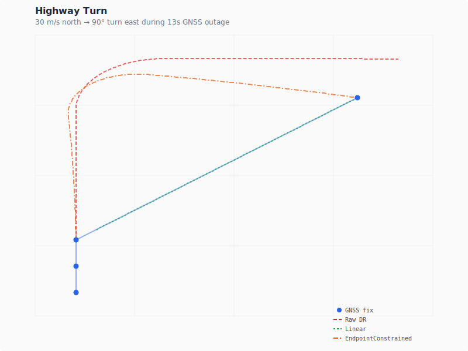
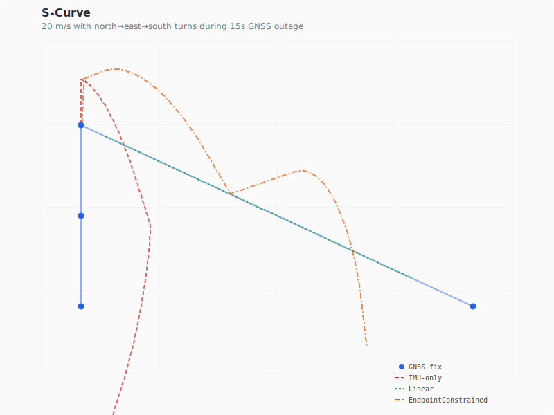
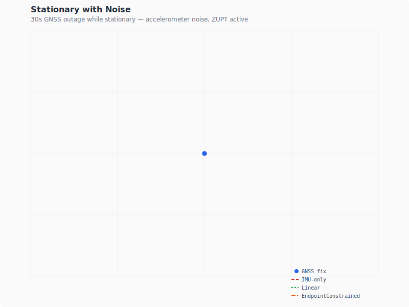
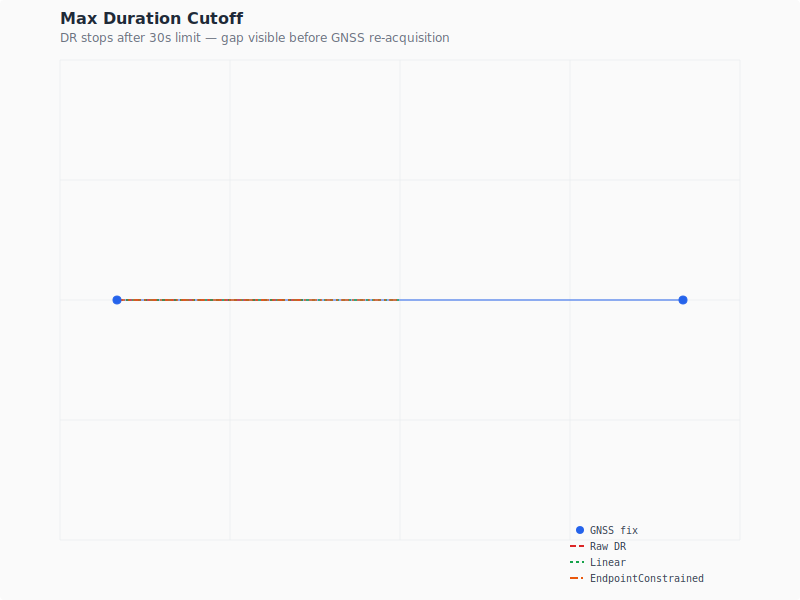

# trajix

**https://sksat.github.io/trajix/**

GNSS/positioning data visualization web app. Parses 1GB+ [Android GNSS Logger](https://play.google.com/store/apps/details?id=com.google.android.apps.location.gps.gnsslogger) log files in-browser via WebAssembly, and visualizes flight trajectories on 3D maps with sky plots and time-series charts.

<table>
  <tr>
    <td></td>
    <td></td>
    <td></td>
  </tr>
  <tr>
    <td><em>Chitose → Narita flight</em></td>
    <td><em>Mt. Tsukuba ascent</em></td>
    <td><em>Mt. Tsukuba descent</em></td>
  </tr>
</table>

## Features

- **In-browser WebAssembly parser** — streams 1GB+ files without server upload
- **3D flight visualization** — CesiumJS with GSI terrain tiles, camera follow mode
- **Sky plot** — real-time satellite positions with constellation filtering
- **Time-series charts** — CN0, satellite count, accuracy, speed (uPlot)
- **DuckDB-wasm** — SQL queries on parsed data in-browser

## Rust library

### Quick start

```rust
use trajix::prelude::*;

let file = std::fs::File::open("gnss_log.txt").unwrap();
let reader = std::io::BufReader::new(file);
let mut parser = StreamingParser::new(reader);

for result in &mut parser {
    match result {
        Ok(Record::Fix(fix)) => {
            println!("{}: ({}, {})",
                fix.provider, fix.latitude_deg, fix.longitude_deg);
        }
        Ok(_) => {} // Status, Raw, IMU sensors, etc.
        Err(e) => eprintln!("parse error: {e}"),
    }
}

if let Some(header) = parser.header() {
    println!("{} {}", header.manufacturer, header.model);
}
```

### Extract fixes with iterator extensions

```rust
use trajix::prelude::*;

let file = std::fs::File::open("gnss_log.txt").unwrap();
let parser = StreamingParser::new(std::io::BufReader::new(file));

// Collect only GPS+FLP fixes (skip NLP)
let fixes: Vec<FixRecord> = parser.primary_fixes().collect();

println!("{} primary fixes", fixes.len());
```

### Distance, speed, and statistics

```rust
use trajix::{FixRecord, summarize_fixes};

fn analyze(fixes: &[FixRecord]) {
    // Distance and speed between two fixes
    let dist = fixes[0].distance_to(&fixes[1]); // meters
    let dt = fixes[0].time_delta_s(&fixes[1]);   // seconds
    let speed = fixes[0].speed_between(&fixes[1]); // Option<f64> m/s

    // Summary statistics
    let stats = summarize_fixes(fixes);
    println!("Duration: {:.0}s", stats.duration_s);
    println!("Distance: {:.0}m", stats.total_distance_m);
    if let Some(acc) = &stats.accuracy {
        println!("Accuracy: median={:.1}m, p95={:.1}m", acc.median, acc.p95);
    }
}
```

### Fix quality classification

```rust
use trajix::{classify_fixes, FixQuality, FixRecord, DEFAULT_GAP_THRESHOLD_MS};

fn classify(fixes: &[FixRecord]) {
    let qualities = classify_fixes(fixes, DEFAULT_GAP_THRESHOLD_MS);
    for (fix, quality) in fixes.iter().zip(&qualities) {
        match quality {
            FixQuality::Primary => { /* GPS/FLP - use for track */ }
            FixQuality::GapFallback => { /* NLP during GPS gap */ }
            FixQuality::Rejected => { /* NLP redundant with GPS */ }
        }
    }
}
```

### Geodesic utilities

```rust
use trajix::geo::{haversine_distance_m, bearing_deg};

let dist = haversine_distance_m(35.6812, 139.7671, 34.7024, 135.4959);
println!("Tokyo to Osaka: {:.0} km", dist / 1000.0);

let bearing = bearing_deg(35.6812, 139.7671, 34.7024, 135.4959);
println!("Bearing: {:.1}°", bearing);
```

### Dead Reckoning (GNSS + IMU fusion)

```rust
use trajix::prelude::*;

let file = std::fs::File::open("gnss_log.txt").unwrap();
let parser = StreamingParser::new(std::io::BufReader::new(file));

let mut dr = DeadReckoning::new(DeadReckoningConfig::default());
for result in parser {
    if let Ok(record) = result {
        if let Some(point) = dr.push_record(&record) {
            println!("{}: ({}, {}) [{:?}]",
                point.time_ms, point.latitude_deg, point.longitude_deg, point.source);
        }
    }
}

let trajectory = dr.finalize();
println!("{} trajectory points", trajectory.len());
```

### Data fusion edge case visualizations

SVG trajectory plots generated by `cargo test -p trajix dr_viz -- --ignored`.
Blue = GNSS fix, red dashed = IMU-only DR, green dashed = linear interpolation, orange = endpoint-constrained (t² weighting).

<table>
  <tr>
    <td></td>
    <td></td>
  </tr>
  <tr>
    <td><em>Urban Canyon — rapid GNSS good/bad alternation</em></td>
    <td><em>Tunnel — 60s IMU-only at 72 km/h</em></td>
  </tr>
  <tr>
    <td></td>
    <td></td>
  </tr>
  <tr>
    <td><em>Highway Turn — 90° turn during GNSS outage</em></td>
    <td><em>S-Curve — north→east→south at 20 m/s</em></td>
  </tr>
  <tr>
    <td></td>
    <td></td>
  </tr>
  <tr>
    <td><em>Stationary — ZUPT prevents drift</em></td>
    <td><em>Max Duration — DR stops at 30s limit</em></td>
  </tr>
</table>

## Modules

| Module | Description |
|--------|-------------|
| `prelude` | Convenience re-exports for common usage patterns |
| `parser` | Streaming CSV parser (`StreamingParser`), line parser (`parse_line`), iterator filters |
| `record` | Typed record structs: `FixRecord`, `StatusRecord`, `RawRecord`, sensor records |
| `types` | Core enums: `ConstellationType`, `FixProvider`, `RecordType`, `CodeType` |
| `geo` | Geodesic utilities: `haversine_distance_m`, `bearing_deg` |
| `quality` | Fix quality classification: `FixQuality`, `classify_fixes` |
| `stats` | Statistical summaries: `summarize_fixes`, `PercentileStats` |
| `summary` | Epoch aggregation: `EpochAggregator`, `StatusEpoch`, `FixEpoch` |
| `downsample` | Time-series reduction: `decimate_by_time`, `lttb`, `StreamingDecimator` |
| `dead_reckoning` | GNSS + IMU fusion: `DeadReckoning`, `DeadReckoningConfig`, streaming `push_record()` API |
| `altitude` | Altitude analysis: `filter_altitude_spikes`, `smooth_altitudes`, vertical velocity |
| `anomaly` | Jump/anomaly detection: `analyze_jumps`, implied speed histograms |
| `coverage` | Gap analysis: `analyze_coverage`, NLP gap detection |
| `pipeline` | Streaming processor: `GnssProcessor`, `ProcessingResult` |

## Record types

| Type | Description |
|------|-------------|
| `Fix` | GPS/FLP/NLP position fixes with accuracy, speed, bearing |
| `Status` | Satellite visibility and signal strength per constellation |
| `Raw` | Raw GNSS measurements (pseudorange, carrier phase, Doppler) |
| `UncalAccel` / `UncalGyro` / `UncalMag` | Uncalibrated IMU sensors |
| `OrientationDeg` | Device orientation (azimuth, pitch, roll) |
| `GameRotationVector` | Fused rotation quaternion |

## License

[MPL-2.0](LICENSE)
